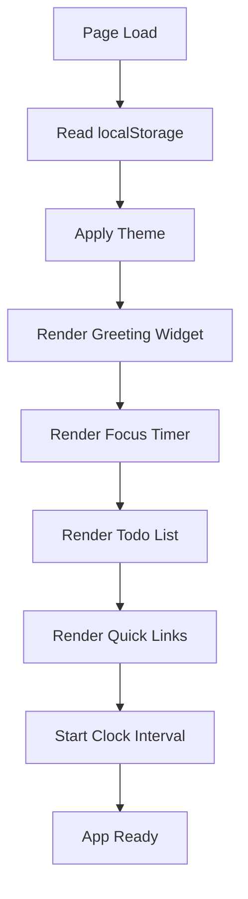
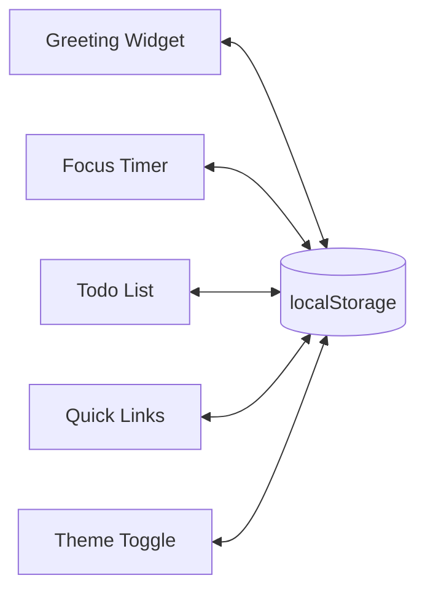
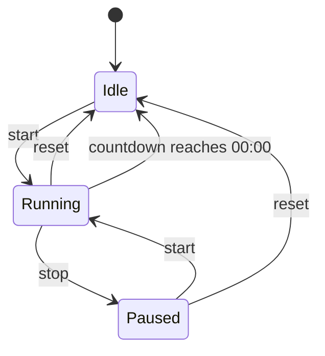

# Design Document: Life Dashboard

## Overview

The Life Dashboard is a single-page, client-side web application built with plain HTML, CSS, and Vanilla JavaScript. It runs entirely in the browser with no backend, no build step, and no external dependencies — making it openable directly from the file system.

The application is organized into four functional widgets:
- **Greeting Widget** — displays live time, date, and a personalized greeting
- **Focus Timer** — a Pomodoro-style countdown timer with start/stop/reset controls
- **To-Do List** — a task manager with add, edit, complete, and delete operations
- **Quick Links** — a shortcut panel for user-defined URL bookmarks

All user data (tasks, links, name, theme preference) is persisted exclusively in `localStorage`. Three optional enhancements are included: Light/Dark mode toggle, custom name in greeting, and duplicate task prevention.

---

## Architecture

The application follows a simple **widget-based MVC pattern** without any framework. Each widget owns its own state, DOM manipulation, and storage interactions. A thin shared module handles `localStorage` access and theme initialization.

```
index.html
├── css/
│   └── styles.css          (single stylesheet — all themes, layouts, components)
└── js/
    └── app.js              (single JS file — all widget logic, storage, init)
```

### Initialization Flow



### Widget Interaction Model

Each widget is self-contained. Widgets do not communicate with each other directly. The only shared concern is `localStorage` — each widget reads and writes its own key(s).



---

## Components and Interfaces

### Greeting Widget

**Responsibilities:**
- Display current time (HH:MM), updated every 60 seconds via `setInterval`
- Display current date in human-readable format
- Compute and display time-appropriate greeting prefix (morning/afternoon/evening)
- Optionally append a saved `User_Name` to the greeting
- Provide an input field to set/update `User_Name`

**Key Functions:**
```
getGreetingPrefix(hour: number): string
  → "Good morning" | "Good afternoon" | "Good evening"

formatTime(date: Date): string
  → "HH:MM"

formatDate(date: Date): string
  → "Monday, April 25, 2026"

buildGreeting(prefix: string, name: string | null): string
  → "[prefix], [name]!" | "[prefix]!"

updateGreetingWidget(): void
  → reads current time, updates DOM

saveUserName(name: string): void
  → writes to localStorage, updates greeting
```

**Hour Ranges:**
- 05:00–11:59 → "Good morning"
- 12:00–17:59 → "Good afternoon"
- 18:00–04:59 → "Good evening"

---

### Focus Timer

**Responsibilities:**
- Maintain countdown state: `idle | running | paused`
- Count down one second per second when running
- Notify user (alert or audio) when countdown reaches zero
- Expose start, stop, and reset controls

**State Machine:**



**Key Functions:**
```
startTimer(): void
stopTimer(): void
resetTimer(): void
tick(): void          → decrements seconds, updates DOM, checks for completion
formatCountdown(totalSeconds: number): string  → "MM:SS"
notifyCompletion(): void  → browser alert or Audio API beep
```

**Default duration:** 25 minutes (1500 seconds)

---

### To-Do List

**Responsibilities:**
- Add tasks (with duplicate prevention)
- Edit tasks inline
- Toggle completion state
- Delete tasks
- Persist full task array to `localStorage` on every mutation

**Task Object Shape:**
```
{ id: string, description: string, completed: boolean }
```

**Key Functions:**
```
addTask(description: string): Result<Task, DuplicateError | EmptyError>
editTask(id: string, newDescription: string): void
toggleTask(id: string): void
deleteTask(id: string): void
loadTasks(): Task[]
saveTasks(tasks: Task[]): void
renderTaskList(tasks: Task[]): void
isDuplicate(description: string, tasks: Task[]): boolean
  → case-insensitive comparison
```

---

### Quick Links

**Responsibilities:**
- Add links (label + URL, both required, URL must be valid)
- Display links as clickable buttons opening in a new tab
- Delete links
- Persist full link array to `localStorage` on every mutation

**Link Object Shape:**
```
{ id: string, label: string, url: string }
```

**Key Functions:**
```
addLink(label: string, url: string): Result<Link, ValidationError>
deleteLink(id: string): void
loadLinks(): Link[]
saveLinks(links: Link[]): void
renderLinks(links: Link[]): void
isValidUrl(url: string): boolean
```

---

### Theme Toggle

**Responsibilities:**
- Toggle between `light` and `dark` themes
- Apply theme by setting a `data-theme` attribute on `<html>` or `<body>`
- Persist selected theme to `localStorage`
- Load and apply saved theme on startup (default: `light`)

**Key Functions:**
```
applyTheme(theme: "light" | "dark"): void
toggleTheme(): void
loadTheme(): "light" | "dark"
saveTheme(theme: "light" | "dark"): void
```

---

### Storage Module

A thin wrapper around `localStorage` that catches errors and surfaces a non-blocking warning.

**Key Functions:**
```
storageGet(key: string): string | null
storageSet(key: string, value: string): void
storageRemove(key: string): void
```

**localStorage Keys:**
| Key | Value |
|-----|-------|
| `ld_tasks` | JSON array of Task objects |
| `ld_links` | JSON array of Link objects |
| `ld_username` | string |
| `ld_theme` | `"light"` or `"dark"` |

---

## Data Models

### Task

```typescript
interface Task {
  id: string;          // UUID or timestamp-based unique ID
  description: string; // Non-empty, trimmed text
  completed: boolean;  // false on creation
}
```

**Invariants:**
- `description` is never empty or whitespace-only
- `description` is unique within the task list (case-insensitive)
- `id` is unique within the task list

---

### Link

```typescript
interface Link {
  id: string;    // UUID or timestamp-based unique ID
  label: string; // Non-empty display text
  url: string;   // Non-empty, passes URL validation
}
```

**Invariants:**
- `label` is never empty
- `url` is never empty and passes `isValidUrl` check
- `id` is unique within the link list

---

### Persisted State Shape

```json
{
  "ld_tasks": "[{\"id\":\"1\",\"description\":\"Buy milk\",\"completed\":false}]",
  "ld_links": "[{\"id\":\"2\",\"label\":\"GitHub\",\"url\":\"https://github.com\"}]",
  "ld_username": "Alice",
  "ld_theme": "dark"
}
```

All values are stored as JSON strings and parsed on load.

---

## Correctness Properties

*A property is a characteristic or behavior that should hold true across all valid executions of a system — essentially, a formal statement about what the system should do. Properties serve as the bridge between human-readable specifications and machine-verifiable correctness guarantees.*

### Property 1: Greeting prefix is exhaustive and correct

*For any* integer hour in the range 0–23, `getGreetingPrefix(hour)` SHALL return exactly one of "Good morning" (hours 5–11), "Good afternoon" (hours 12–17), or "Good evening" (hours 18–23 and 0–4). Every hour maps to exactly one prefix with no gaps or overlaps.

**Validates: Requirements 1.3, 1.4, 1.5**

---

### Property 2: Time format is well-formed

*For any* `Date` object, `formatTime(date)` SHALL return a string matching the pattern `HH:MM` where HH is the zero-padded hour (00–23) and MM is the zero-padded minute (00–59), and the values SHALL match the date's actual hours and minutes.

**Validates: Requirements 1.1**

---

### Property 3: Greeting string format with and without name

*For any* greeting prefix string and any non-empty `User_Name`, `buildGreeting(prefix, name)` SHALL return `"[prefix], [name]!"`. *For any* prefix with a null or empty name, it SHALL return `"[prefix]!"`. Both cases hold for all valid prefix values.

**Validates: Requirements 2.2, 2.3**

---

### Property 4: User name persistence round-trip

*For any* non-empty string used as a `User_Name`, calling `saveUserName(name)` followed by `loadUserName()` SHALL return the original string unchanged.

**Validates: Requirements 2.4, 2.5**

---

### Property 5: Countdown format round-trip

*For any* integer number of seconds in the range 0–1499, `formatCountdown(seconds)` SHALL return a string matching the pattern `MM:SS` where MM and SS are zero-padded, and parsing that string back to total seconds SHALL yield the original value.

**Validates: Requirements 3.1**

---

### Property 6: Task addition grows the list

*For any* task list and any valid (non-empty, non-whitespace, non-duplicate) task description, calling `addTask` SHALL result in the task list length increasing by exactly one and the new task appearing in the list with the correct description and `completed: false`.

**Validates: Requirements 4.2**

---

### Property 7: Whitespace and empty task rejection

*For any* string composed entirely of whitespace characters (or the empty string), `addTask` SHALL reject it and the task list length SHALL remain unchanged.

**Validates: Requirements 4.2**

---

### Property 8: Duplicate task rejection preserves list

*For any* task list containing at least one task, submitting a description that matches any existing task description (case-insensitive) SHALL be rejected — the list length SHALL remain unchanged and the task SHALL NOT appear twice in `localStorage`.

**Validates: Requirements 5.1, 5.3**

---

### Property 9: Task completion toggle is an involution

*For any* task, calling `toggleTask` twice in succession SHALL return the task's `completed` field to its original value (toggling is its own inverse).

**Validates: Requirements 4.5**

---

### Property 10: Task deletion removes the task

*For any* task list containing at least one task, calling `deleteTask(id)` for a task in the list SHALL result in a list that no longer contains a task with that id, and the updated list in `localStorage` SHALL also not contain that task.

**Validates: Requirements 4.6**

---

### Property 11: Task persistence round-trip

*For any* collection of tasks (including empty), serializing the collection with `saveTasks` and then deserializing with `loadTasks` SHALL produce a collection equal to the original — same length, same ids, same descriptions, and same completion states.

**Validates: Requirements 4.7, 4.8, 8.1**

---

### Property 12: Link addition grows the list

*For any* link list and any valid (non-empty label, valid URL) link, calling `addLink` SHALL result in the link list length increasing by exactly one and the new link appearing with the correct label and URL.

**Validates: Requirements 6.2**

---

### Property 13: Invalid link submission is rejected

*For any* link submission where the label is empty, the URL is empty, or the URL fails `isValidUrl`, `addLink` SHALL reject the submission and the link list length SHALL remain unchanged.

**Validates: Requirements 6.7**

---

### Property 14: Link deletion removes the link

*For any* link list containing at least one link, calling `deleteLink(id)` for a link in the list SHALL result in a list that no longer contains a link with that id, and the updated list in `localStorage` SHALL also not contain that link.

**Validates: Requirements 6.4**

---

### Property 15: Link persistence round-trip

*For any* collection of links (including empty), serializing the collection with `saveLinks` and then deserializing with `loadLinks` SHALL produce a collection equal to the original — same length, same ids, same labels, and same URLs.

**Validates: Requirements 6.5, 6.6, 8.1**

---

### Property 16: Theme persistence round-trip

*For any* theme value (`"light"` or `"dark"`), calling `saveTheme(theme)` followed by `loadTheme()` SHALL return the same theme value.

**Validates: Requirements 7.3, 7.4**

---

## Error Handling

### localStorage Unavailability

If `localStorage` is unavailable (e.g., private browsing with storage blocked, quota exceeded), the storage wrapper catches the exception and:
1. Logs the error to the console
2. Displays a non-blocking banner/toast message: "Storage unavailable — your data won't be saved."
3. Allows the app to continue functioning in-memory for the session

### Invalid Stored Data

If JSON parsing of a stored value fails (corrupted data), the affected widget:
1. Falls back to an empty default (empty array for tasks/links, `null` for name, `"light"` for theme)
2. Does not crash or block other widgets

### User Input Validation

| Widget | Invalid Input | Response |
|--------|--------------|----------|
| Todo List | Empty description | Inline error: "Task cannot be empty" |
| Todo List | Duplicate description | Inline error: "Task already exists" |
| Quick Links | Empty label | Inline error: "Label is required" |
| Quick Links | Empty or invalid URL | Inline error: "Please enter a valid URL" |
| Greeting | Empty name input | Clears saved name, reverts to prefix-only greeting |

All error messages are displayed inline (adjacent to the relevant input), not as modal dialogs or browser alerts.

---

## Testing Strategy

### PBT Applicability Assessment

This feature is a client-side web application with pure transformation functions (greeting prefix logic, countdown formatting, task/link serialization, duplicate detection). These pure functions are well-suited for property-based testing. UI rendering and DOM interactions are not suitable for PBT and will be covered by example-based tests.

### Property-Based Testing

**Library:** [fast-check](https://github.com/dubzzz/fast-check) (JavaScript, runs in Node.js or browser)

**Configuration:** Minimum 100 iterations per property test.

Each property test is tagged with a comment referencing the design property:
```
// Feature: life-dashboard, Property N: <property_text>
```

**Properties to implement as PBT:**

| Property | Function Under Test | Generator |
|----------|-------------------|-----------|
| P1: Greeting prefix exhaustive coverage | `getGreetingPrefix` | `fc.integer({ min: 0, max: 23 })` |
| P2: Time format well-formed | `formatTime` | `fc.date()` |
| P3: Greeting string format | `buildGreeting` | `fc.string()` for prefix, `fc.option(fc.string({ minLength: 1 }))` for name |
| P4: User name persistence round-trip | `saveUserName` + `loadUserName` | `fc.string({ minLength: 1 })` |
| P5: Countdown format round-trip | `formatCountdown` | `fc.integer({ min: 0, max: 1499 })` |
| P6: Task addition grows list | `addTask` | `fc.array(taskArb)` + valid description |
| P7: Whitespace task rejection | `addTask` | `fc.stringOf(fc.char().filter(c => /\s/.test(c)))` |
| P8: Duplicate task rejection | `isDuplicate` + `addTask` | `fc.array(taskArb, { minLength: 1 })` |
| P9: Task completion toggle involution | `toggleTask` | `fc.record({ id: fc.uuid(), description: fc.string({ minLength: 1 }), completed: fc.boolean() })` |
| P10: Task deletion removes task | `deleteTask` | `fc.array(taskArb, { minLength: 1 })` |
| P11: Task persistence round-trip | `saveTasks` + `loadTasks` | `fc.array(taskArb)` |
| P12: Link addition grows list | `addLink` | `fc.array(linkArb)` + valid label/URL |
| P13: Invalid link rejection | `addLink` | invalid label or URL inputs |
| P14: Link deletion removes link | `deleteLink` | `fc.array(linkArb, { minLength: 1 })` |
| P15: Link persistence round-trip | `saveLinks` + `loadLinks` | `fc.array(linkArb)` |
| P16: Theme persistence round-trip | `saveTheme` + `loadTheme` | `fc.constantFrom("light", "dark")` |

### Unit / Example-Based Tests

- Timer state machine transitions (start → running, stop → paused, reset → idle)
- Countdown completion notification fires at 00:00
- Theme toggle switches between light and dark
- localStorage error handling (mock `localStorage` to throw)
- DOM rendering: tasks render with correct structure, links open in new tab
- Inline error messages appear and disappear correctly

### Integration / Smoke Tests

- Full page load restores all persisted data correctly
- App functions when opened from the file system (no server)
- App renders correctly in Chrome, Firefox, Edge, Safari (manual or Playwright)
